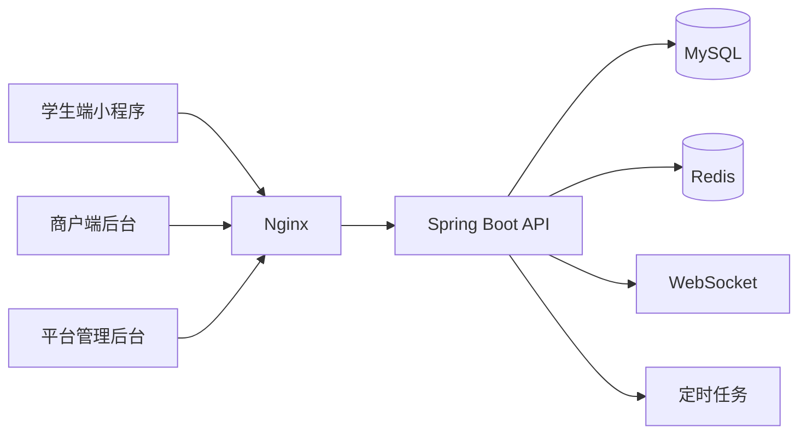

# 高校校园餐饮管理系统开发文档

## 1. 文档目标

本文档用于从 0 复现一套面向高校校园场景的垂直餐饮管理系统，覆盖学生端小程序、商户端、平台管理后台的核心业务设计、技术方案、库表规划、接口边界与部署方案。文档以“可直接指导开发”为目标，优先保证业务闭环和后续扩展性。

## 2. 项目概述

### 2.1 项目背景

高校校园餐饮场景通常存在以下问题：

- 商户入驻与审核流程依赖线下沟通，效率低。
- 菜品、套餐、库存、营业状态变更无法统一管理。
- 学生下单、商户接单、配送履约之间信息同步不及时。
- 高峰期订单激增，容易出现库存超卖、接口响应慢、订单状态不一致。
- 管理层缺少按商户、时间、菜品维度的数据统计能力。

### 2.2 建设目标

建设一套校园餐饮管理系统，实现从商户入驻、商品管理、学生下单、订单履约、配送调度到运营统计的全流程闭环，重点解决：

- 商户管理效率低
- 点餐流程不规范
- 订单信息不同步
- 高并发下超卖与系统稳定性问题

### 2.3 系统终端

为保证业务闭环，本文按 3 类终端设计：

- 学生端小程序
- 商户端后台
- 平台管理后台

说明：如果最终只需要“两大模块”交付，可将商户端与平台后台合并为一个 Web 后台，通过角色权限区分菜单与数据范围。

### 2.4 核心成果目标

- 缓存命中率达到 95% 以上
- 数据库访问压力降低 40% 左右
- 支撑秒杀场景 5000+ 峰值并发
- WebSocket 来单提醒延迟控制在 300ms 内
- 订单超时自动处理准确率达到 100%
- 系统接口可用性达到 99.9%

## 3. 推荐技术栈

### 3.1 后端技术

- JDK 17
- Spring Boot 3.2.x
- Spring MVC
- MyBatis
- MySQL 8.0
- Redis 7.x
- WebSocket
- JWT
- Spring Scheduling
- Nginx

### 3.2 前端技术

- 学生端：微信小程序原生或 Taro
- 商户端/平台端：Vue + Element Plus

### 3.3 复现建议

为了尽快落地，建议首版采用“单体应用 + 模块化分层”的方案，而不是上来拆微服务。原因：

- 当前项目目标是先恢复业务闭环
- 技术栈与原项目经历更贴近
- 部署简单，调试成本低
- 秒杀、缓存、WebSocket 等高并发能力依然可以在单体架构中实现

后续若业务量增长，可再拆分订单、商品、配送、消息等服务。

## 4. 业务角色与权限

### 4.1 角色定义

- 学生用户：浏览商家、加入购物车、下单、支付、查看订单、催单、取消订单、评价
- 商户用户：维护门店、菜品、套餐、库存、营业状态，接单、出餐、查看配送状态、查看营业数据
- 平台管理员：审核商户入驻、管理校园区域、配置配送规则、查看全局经营数据、处理异常订单
- 配送员或跑腿人员：接单、取餐、配送、完成履约

### 4.2 权限模型

采用 `RBAC` 模型：

- 用户 -> 角色
- 角色 -> 菜单/按钮权限
- 角色 -> 数据范围权限

示例：

- 商户账号仅能查看所属门店数据
- 平台管理员可跨商户查看统计数据
- 配送员仅可访问被分配订单

## 5. 功能范围设计

### 5.1 学生端小程序

#### 5.1.1 基础功能

- 微信登录/手机号绑定
- 校园校区、宿舍楼、收货地址维护
- 商家列表与搜索
- 菜品分类浏览
- 套餐与单品展示
- 营业状态与配送费展示

#### 5.1.2 交易功能

- 购物车
- 下单确认
- 优惠券或满减计算
- 在线支付
- 订单详情查看
- 取消订单
- 再来一单
- 催单
- 订单评价

#### 5.1.3 消息功能

- 订单状态变更通知
- 配送进度通知
- 秒杀活动开始提醒

### 5.2 商户端后台

#### 5.2.1 门店管理

- 商户入驻申请
- 门店信息维护
- 营业时间配置
- 配送范围配置
- 起送价、配送费配置
- 门店营业开关

#### 5.2.2 商品管理

- 菜品分类管理
- 单品管理
- 套餐管理
- 图片上传
- 上下架
- 库存管理
- 秒杀活动关联

#### 5.2.3 订单管理

- 来单提醒
- 接单/拒单
- 出餐
- 配送中
- 完成
- 取消订单处理
- 异常订单处理

#### 5.2.4 数据统计

- 今日订单数
- 今日营业额
- 热销菜品排行
- 订单状态分布
- 时段营业趋势

### 5.3 平台管理后台

#### 5.3.1 平台运营

- 商户入驻审核
- 商户状态启停
- 校园/楼栋/区域配置
- 配送规则配置
- 秒杀活动配置
- 用户反馈处理

#### 5.3.2 平台统计

- 平台 GMV
- 商户经营排行
- 活跃用户数
- 退款/取消率
- 配送履约时长

## 6. 核心业务流程

### 6.1 商户入驻流程

1. 商户提交入驻资料
2. 平台管理员审核资料
3. 审核通过后创建商户账号和门店
4. 商户首次登录后补充营业信息
5. 商户配置菜品、库存、配送规则后开业

### 6.2 学生下单流程

1. 学生选择商户与菜品
2. 系统校验门店营业状态、库存、配送地址
3. 创建预订单并锁定库存
4. 调起支付
5. 支付成功后生成正式订单
6. 商户收到 WebSocket 来单提醒
7. 商户接单并出餐
8. 系统调度配送员或进入自配送流程
9. 配送完成后订单完结

### 6.3 订单状态流转

建议统一订单状态：

- `PENDING_PAYMENT`：待支付
- `PAID`：已支付待接单
- `ACCEPTED`：商户已接单
- `PREPARING`：备餐中
- `WAITING_DELIVERY`：待配送
- `DELIVERING`：配送中
- `COMPLETED`：已完成
- `CANCELLED`：已取消
- `REFUNDING`：退款中
- `REFUNDED`：已退款

核心规则：

- 待支付超时自动取消
- 已支付但商户长时间未接单触发预警
- 已接单后取消需走退款或人工审核流程
- 配送完成后自动归档统计

### 6.4 秒杀下单流程

1. 用户请求秒杀资格
2. Redis 预扣减库存
3. 校验一人一单
4. 生成秒杀请求对象写入阻塞队列
5. 异步消费者创建订单
6. 数据库通过乐观锁再次校验真实库存
7. 成功后返回抢购成功结果
8. 失败则回滚 Redis 状态并提示售罄或重复下单

### 6.5 超时订单处理流程

定时任务每分钟扫描一次：

- 待支付超过 15 分钟自动取消
- 已支付超过商户接单时限可转异常订单
- 配送超时订单进入人工介入队列

## 7. 系统架构设计

### 7.1 总体架构



### 7.2 分层架构

- `controller`：接收请求、参数校验、统一响应
- `service`：业务编排
- `domain`：核心领域模型与业务规则
- `mapper`：MyBatis 持久层
- `job`：定时任务
- `ws`：WebSocket 推送
- `security`：JWT、签名校验、权限控制
- `cache`：缓存封装、热点数据管理

### 7.3 后端模块拆分

建议按业务模块拆包：

- `auth`：登录、JWT、API 签名校验
- `user`：学生、商户、管理员、配送员账户
- `merchant`：商户入驻、门店、营业配置
- `product`：分类、菜品、套餐、库存
- `cart`：购物车
- `order`：订单、订单明细、状态流转
- `delivery`：配送调度与履约
- `promotion`：满减、优惠券、秒杀
- `message`：WebSocket 通知
- `statistics`：运营数据统计
- `common`：通用组件、异常、响应体、工具类

## 8. 数据库设计

### 8.1 核心表清单

建议首版包含以下核心表：

- `student_user`：学生用户
- `merchant_user`：商户后台用户
- `sys_admin`：平台管理员
- `delivery_user`：配送员
- `merchant`：商户主体
- `store`：门店信息
- `store_business_hours`：营业时间
- `product_category`：菜品分类
- `product_spu`：菜品/SPU
- `product_sku`：规格/SKU
- `combo`：套餐
- `combo_item`：套餐明细
- `shopping_cart`：购物车
- `orders`：订单主表
- `order_item`：订单明细
- `order_log`：订单日志
- `delivery_order`：配送单
- `merchant_apply`：商户入驻申请
- `seckill_activity`：秒杀活动
- `seckill_order`：秒杀订单关系表
- `payment_record`：支付记录
- `coupon`：优惠券
- `user_coupon`：用户优惠券
- `daily_statistics`：日报统计

### 8.2 核心表字段设计

#### 8.2.1 商户表 `merchant`

| 字段 | 类型 | 说明 |
| --- | --- | --- |
| id | bigint | 主键 |
| merchant_name | varchar(64) | 商户名称 |
| contact_name | varchar(32) | 联系人 |
| contact_phone | varchar(20) | 联系电话 |
| status | tinyint | 0待审核 1正常 2禁用 |
| settle_type | tinyint | 结算方式 |
| campus_code | varchar(32) | 所属校区 |
| created_at | datetime | 创建时间 |
| updated_at | datetime | 更新时间 |

#### 8.2.2 门店表 `store`

| 字段 | 类型 | 说明 |
| --- | --- | --- |
| id | bigint | 主键 |
| merchant_id | bigint | 商户ID |
| store_name | varchar(64) | 门店名称 |
| address | varchar(255) | 地址 |
| lng | decimal(10,6) | 经度 |
| lat | decimal(10,6) | 纬度 |
| delivery_type | tinyint | 1自配送 2平台配送 |
| min_order_amount | decimal(10,2) | 起送价 |
| delivery_fee | decimal(10,2) | 配送费 |
| business_status | tinyint | 0休息中 1营业中 |
| deleted | tinyint | 逻辑删除 |
| created_at | datetime | 创建时间 |
| updated_at | datetime | 更新时间 |

#### 8.2.3 菜品表 `product_spu`

| 字段 | 类型 | 说明 |
| --- | --- | --- |
| id | bigint | 主键 |
| store_id | bigint | 门店ID |
| category_id | bigint | 分类ID |
| product_name | varchar(64) | 菜品名称 |
| product_type | tinyint | 1单品 2套餐 |
| image_url | varchar(255) | 图片地址 |
| description | varchar(255) | 描述 |
| sale_status | tinyint | 0下架 1上架 |
| sort_no | int | 排序值 |
| created_at | datetime | 创建时间 |
| updated_at | datetime | 更新时间 |

#### 8.2.4 SKU 表 `product_sku`

| 字段 | 类型 | 说明 |
| --- | --- | --- |
| id | bigint | 主键 |
| spu_id | bigint | SPU ID |
| sku_name | varchar(64) | 规格名称 |
| price | decimal(10,2) | 售价 |
| stock | int | 库存 |
| sold_num | int | 已售数量 |
| version | int | 乐观锁版本号 |
| status | tinyint | 状态 |
| created_at | datetime | 创建时间 |
| updated_at | datetime | 更新时间 |

#### 8.2.5 订单主表 `orders`

| 字段 | 类型 | 说明 |
| --- | --- | --- |
| id | bigint | 主键 |
| order_no | bigint | 订单号 |
| user_id | bigint | 学生ID |
| store_id | bigint | 门店ID |
| merchant_id | bigint | 商户ID |
| order_type | tinyint | 1普通订单 2秒杀订单 |
| order_status | varchar(32) | 订单状态 |
| goods_amount | decimal(10,2) | 商品总额 |
| delivery_fee | decimal(10,2) | 配送费 |
| discount_amount | decimal(10,2) | 优惠金额 |
| pay_amount | decimal(10,2) | 实付金额 |
| receiver_name | varchar(32) | 收货人 |
| receiver_phone | varchar(20) | 收货电话 |
| receiver_address | varchar(255) | 收货地址 |
| remark | varchar(255) | 备注 |
| pay_time | datetime | 支付时间 |
| accept_time | datetime | 接单时间 |
| complete_time | datetime | 完成时间 |
| cancel_time | datetime | 取消时间 |
| cancel_reason | varchar(255) | 取消原因 |
| created_at | datetime | 创建时间 |
| updated_at | datetime | 更新时间 |

#### 8.2.6 订单明细表 `order_item`

| 字段 | 类型 | 说明 |
| --- | --- | --- |
| id | bigint | 主键 |
| order_id | bigint | 订单ID |
| sku_id | bigint | SKU ID |
| spu_name | varchar(64) | 商品名称 |
| sku_name | varchar(64) | 规格名称 |
| price | decimal(10,2) | 单价 |
| quantity | int | 数量 |
| total_amount | decimal(10,2) | 小计 |

#### 8.2.7 配送单表 `delivery_order`

| 字段 | 类型 | 说明 |
| --- | --- | --- |
| id | bigint | 主键 |
| order_id | bigint | 订单ID |
| delivery_user_id | bigint | 配送员ID |
| dispatch_status | tinyint | 0待分配 1已分配 2配送中 3已完成 |
| pickup_time | datetime | 取餐时间 |
| delivered_time | datetime | 送达时间 |
| dispatch_remark | varchar(255) | 调度备注 |
| created_at | datetime | 创建时间 |
| updated_at | datetime | 更新时间 |

### 8.3 索引设计建议

- `orders(order_no)` 唯一索引
- `orders(user_id, created_at)` 普通索引
- `orders(store_id, order_status)` 联合索引
- `product_sku(spu_id)` 普通索引
- `seckill_order(user_id, activity_id)` 唯一索引，限制一人一单
- `merchant_apply(status, created_at)` 联合索引
- `delivery_order(delivery_user_id, dispatch_status)` 联合索引

## 9. Redis 与缓存设计

### 9.1 Redis 核心用途

- 热门商户和菜品缓存
- 商品详情缓存
- 门店营业状态缓存
- 购物车缓存
- 秒杀库存预扣减
- 分布式锁
- 全局唯一订单 ID 生成
- 用户会话与登录态存储

### 9.2 Key 设计规范

| Key 示例 | 说明 |
| --- | --- |
| `store:detail:{storeId}` | 门店详情缓存 |
| `product:detail:{skuId}` | 菜品缓存 |
| `category:list:{storeId}` | 分类列表 |
| `cart:{userId}` | 用户购物车 |
| `stock:sku:{skuId}` | 普通库存 |
| `seckill:stock:{activityId}:{skuId}` | 秒杀库存 |
| `lock:product:{skuId}` | 热点商品互斥锁 |
| `order:id:inc:{yyyyMMdd}` | 订单号自增序列 |
| `ws:merchant:{merchantId}` | 商户在线连接标识 |

### 9.3 缓存优化策略

#### 9.3.1 缓存穿透

对不存在的数据写入空值缓存，TTL 设置较短，例如 2 到 5 分钟，防止恶意 ID 请求直接打到数据库。

#### 9.3.2 缓存雪崩

不同业务 Key 在基础 TTL 上增加随机值，例如：

- 商品详情：30 分钟 + 0 到 10 分钟随机数
- 门店信息：60 分钟 + 0 到 20 分钟随机数
- 分类列表：20 分钟 + 0 到 5 分钟随机数

#### 9.3.3 缓存击穿

对热点 Key 使用 `SETNX + EXPIRE` 获取互斥锁，只有一个线程回源数据库并重建缓存，其余线程短暂休眠后重试。

#### 9.3.4 双删策略

更新商户、商品、库存等核心数据时：

1. 先更新数据库
2. 删除缓存
3. 延迟再次删除缓存

适用于降低并发读写不一致风险。

## 10. 秒杀与库存设计

### 10.1 全局唯一订单 ID

采用 Redis 生成全局订单号：

- 高位：当前时间戳相对固定起始时间的偏移量
- 低位：Redis 当日自增序列

示例结构：

`orderNo = timestampOffset << 32 | redisIncrement`

优点：

- 保证趋势递增
- 高并发场景下不依赖数据库主键生成
- 可支持分布式部署

### 10.2 防超卖方案

数据库层采用乐观锁：

```sql
update product_sku
set stock = stock - 1, version = version + 1
where id = #{skuId}
  and stock > 0
  and version = #{version};
```

说明：

- 秒杀预扣减先在 Redis 完成
- 异步创建订单时在 MySQL 再次校验库存
- 数据库更新失败则判定为真实库存不足

### 10.3 阻塞队列异步削峰

为贴合原项目方案，首版建议使用应用内阻塞队列处理秒杀请求：

- 用户请求通过资格校验后写入 `BlockingQueue`
- 后台消费线程异步落库生成订单
- 接口快速返回“排队中/处理中”状态

注意：

- 该方案适合单体首版和中小规模集群
- 若后续扩容为多实例，建议将阻塞队列升级为 Redis Stream 或 MQ

## 11. 实时通信与任务调度

### 11.1 WebSocket 来单提醒

连接对象：

- 商户后台登录后建立 WebSocket 连接
- 平台调度端可建立独立连接

推送事件：

- 新订单通知
- 订单取消通知
- 配送状态变更通知
- 秒杀活动告警

性能目标：

- 商户来单提醒控制在 300ms 内
- 前端支持断线重连与心跳检测

### 11.2 定时任务设计

建议使用 Spring Scheduling，首版任务如下：

- `cancelUnpaidOrderJob`：取消超时未支付订单
- `merchantTimeoutAlertJob`：商户未接单预警
- `deliveryTimeoutJob`：配送超时检测
- `dailyStatisticsJob`：每日经营统计汇总
- `cachePrewarmJob`：热门数据预热

## 12. 接口安全设计

### 12.1 认证方案

系统采用“双层校验”：

- 第一层：`API Key + Timestamp + Nonce + Sign`
- 第二层：`JWT`

说明：

- `API Key` 用于识别调用方
- `Sign` 推荐使用 `HMAC-SHA256`
- `JWT` 用于标识登录用户与角色权限

请求头建议：

- `X-API-KEY`
- `X-TIMESTAMP`
- `X-NONCE`
- `X-SIGN`
- `Authorization: Bearer <token>`

### 12.2 安全规则

- 时间戳超时请求直接拒绝
- `nonce` 短期存 Redis 防重放
- JWT 过期后需刷新或重新登录
- 商户后台接口统一鉴权角色
- 关键操作写入审计日志

## 13. 接口规划

### 13.1 认证接口

- `POST /api/auth/student/login`
- `POST /api/auth/merchant/login`
- `POST /api/auth/admin/login`
- `POST /api/auth/logout`
- `GET /api/auth/me`

### 13.2 学生端接口

- `GET /api/student/store/list`
- `GET /api/student/store/{id}`
- `GET /api/student/product/list`
- `POST /api/student/cart/add`
- `GET /api/student/cart`
- `POST /api/student/order/preview`
- `POST /api/student/order/create`
- `POST /api/student/order/cancel/{orderId}`
- `GET /api/student/order/list`
- `GET /api/student/order/{orderId}`
- `POST /api/student/seckill/apply`

### 13.3 商户端接口

- `POST /api/merchant/apply`
- `GET /api/merchant/store/detail`
- `PUT /api/merchant/store/update`
- `POST /api/merchant/category/save`
- `POST /api/merchant/product/save`
- `PUT /api/merchant/product/on-shelf/{id}`
- `PUT /api/merchant/product/off-shelf/{id}`
- `GET /api/merchant/order/list`
- `POST /api/merchant/order/accept/{orderId}`
- `POST /api/merchant/order/reject/{orderId}`
- `POST /api/merchant/order/prepare/{orderId}`
- `POST /api/merchant/order/finish/{orderId}`
- `GET /api/merchant/statistics/overview`

### 13.4 平台后台接口

- `GET /api/admin/merchant/apply/list`
- `POST /api/admin/merchant/apply/audit`
- `POST /api/admin/delivery/dispatch`
- `POST /api/admin/seckill/activity/save`
- `GET /api/admin/statistics/dashboard`
- `POST /api/admin/store/enable/{storeId}`
- `POST /api/admin/store/disable/{storeId}`

## 14. 部署方案设计

### 14.1 部署拓扑

- Nginx：静态资源服务、反向代理、负载均衡、WebSocket 转发
- Spring Boot：核心业务服务
- MySQL：业务数据
- Redis：缓存与并发控制

### 14.2 动静分离

- 小程序静态资源或后台前端打包产物部署到 Nginx
- `/api` 路由转发到 Spring Boot
- `/ws` 路由升级为 WebSocket

### 14.3 Nginx 配置要点

- 开启 Gzip
- 配置静态资源缓存头
- `/api` 使用反向代理
- `/ws` 增加 `Upgrade` 与 `Connection` 头
- 后端可配置 upstream 做多实例扩展

## 15. 日志与监控

建议最少具备以下能力：

- 接口访问日志
- 异常堆栈日志
- 订单状态流转日志
- 定时任务执行日志
- 秒杀失败原因日志
- Redis 命中率监控
- WebSocket 在线连接数监控

关键指标：

- QPS
- 平均响应时间
- 数据库慢查询
- Redis 命中率
- 订单创建成功率
- 秒杀成功率
- 订单取消率

## 16. 测试方案

### 16.1 功能测试

- 商户入驻审核流程
- 菜品和套餐新增、编辑、上下架
- 学生购物车与下单
- 商户接单与出餐
- 配送调度与订单完成
- 秒杀活动全流程

### 16.2 并发测试

- 热门商品详情缓存压测
- 秒杀活动 5000 并发压测
- WebSocket 多商户在线压测
- 订单创建接口稳定性压测

### 16.3 异常测试

- 库存不足
- 重复下单
- 重复支付回调
- 商户拒单
- 配送超时
- Redis 宕机降级

## 17. 版本迭代建议

### 17.1 第一阶段：MVP

目标：先跑通主链路。

- 用户登录
- 商户入驻审核
- 商品管理
- 购物车
- 普通订单
- 商户接单
- 配送状态流转
- 基础统计

### 17.2 第二阶段：性能增强

- Redis 缓存体系
- 热点数据互斥锁
- WebSocket 来单提醒
- 定时任务自动取消订单
- API 签名机制

### 17.3 第三阶段：高并发能力

- 秒杀活动
- Redis 全局订单 ID
- 乐观锁库存控制
- 阻塞队列异步削峰

### 17.4 第四阶段：运营完善

- 优惠券
- 评价系统
- 商家画像
- 更细颗粒度报表
- 监控告警

## 18. 交付物建议

建议最终项目按以下目录组织：

```text
campus-catering/
├─ docs/
│  └─ campus-catering-system-dev-doc.md
├─ campus-catering-server/
├─ campus-catering-admin/
└─ campus-catering-miniapp/
```

## 19. 复现阶段的默认约束

由于原项目源码已丢失，本文档默认做如下约束，便于快速复现：

- 以单校园场景为主，后续支持多校区扩展
- 支付流程首版可先做模拟支付，再接微信支付
- 配送模式首版支持平台配送与商户自配送两种
- 秒杀模块优先保证高并发正确性，再逐步增强分布式能力
- 商户端与平台端允许共用一套后端服务，通过角色区分权限

## 20. 下一步实施建议

基于这份文档，建议按以下顺序继续复现：

1. 先搭后端单体工程骨架与基础模块
2. 完成数据库表结构与初始化脚本
3. 实现认证、商户、商品、订单主链路
4. 接入 Redis 缓存与库存控制
5. 增加 WebSocket、定时任务、秒杀模块
6. 最后补齐前端页面与部署配置

如果继续往下做，下一份文档建议直接输出《数据库详细设计 + 接口清单》，这样就可以马上开始建表和写代码。
